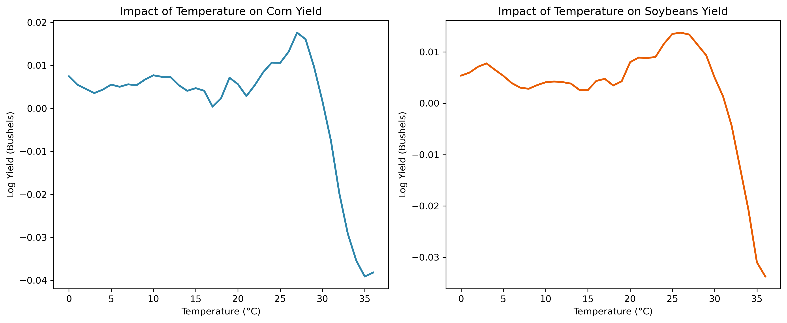

# FPLS: Functional Partial Least Squares

[](https://pypi.org/project/fpls/)
[](https://pepy.tech/project/fpls)
[](https://github.com/ababii/fpls/issues)
[](https://github.com/ababii/fpls/blob/main/LICENSE)

A Python package for functional regression using Partial Least Squares (PLS), implementing the methods developed in:

> **Babii, A., Carrasco, M., & Tsafack, I.** (2025). ["Functional Partial Least-Squares: Adaptive Estimation and Inference."](https://www.tandfonline.com/doi/full/10.1080/01621459.2025.2582874) *Journal of the American Statistical Association*.

## Overview

The **fpls** package provides a clean, scikit-learn-style API for fitting functional PLS regression models with adaptive component selection. The core algorithm uses a conjugate gradient method to solve the functional PLS problem, with integrals approximated via Riemann sums on uniform grids.

**Key Features:**
- **FunctionalPLS estimator** with `.fit()`, `.predict()`, and `.fit_predict()` methods
- **Adaptive early stopping** for automatic component selection
- Support for both **NumPy arrays** and **Pandas DataFrames**
- **Visualization tools** for plotting coefficient functions

## Installation

Install library:

```bash
pip install fpls
```

## Quick Start

### Example: Temperature Effects on Crop Yields

This example demonstrates FPLS on a real-world climate impact study. Using 70 years of county-level data east of 100th meridian, 1950–2020, we analyze how temperature exposure affects corn and soybean yields. The outcome variable is log-yield (bushels per acre), and the functional regressor is the distribution of temperature exposure during the crop growing season, measured in growing degree-days and discretized into 1°C temperature bins.

```python
from fpls import load_example_data, fit_fpls, plot_coefficient_function
import matplotlib.pyplot as plt

# Load corn and soybean data
X_corn, y_corn, s = load_example_data("corn")
X_soy, y_soy, _ = load_example_data("soybeans")

# Fit FPLS models with 10 components
coef_corn, _ = fit_fpls(X_corn, y_corn, m_max=10, ds=1.0)
coef_soy, _ = fit_fpls(X_soy, y_soy, m_max=10, ds=1.0)

# Extract coefficients using m components
m = 4
beta_corn = coef_corn[:, m]
beta_soy = coef_soy[:, m]

```

### Visualizing Results

```python
# Create a figure with two subplots
fig, (ax1, ax2) = plt.subplots(1, 2, figsize=(12, 5))

# Plot corn on the first subplot
plot_coefficient_function(
    s, beta_corn,
    title="Impact of Temperature on Corn Yield",
    xlabel="Temperature (°C)",
    ylabel="Log Yield (Bushels)",
    color="#2E86AB",
    ax=ax1
)

# Plot soybeans on the second subplot
plot_coefficient_function(
    s, beta_soy,
    title="Impact of Temperature on Soybeans Yield",
    xlabel="Temperature (°C)",
    ylabel="Log Yield (Bushels)",
    color="#E85D04",
    ax=ax2
)

fig.savefig('docs/images/crop_yield_comparison.png', dpi=300, bbox_inches='tight')
plt.show()
```

**Output:**



The coefficient functions reveal how different temperature ranges affect crop yields, with the functional approach capturing nonlinearities of temperature effects at different parts of the distribution.

## API Reference

### Main Classes

**`FunctionalPLS(m_max=10, grid_size=None)`**
- `.fit(X, y, ds=None)` - Fit the model
- `.predict(X, n_components=None)` - Make predictions
- `.fit_predict(X, y, ds=None, n_components=None)` - Fit and predict
- `.coef_` - Fitted coefficients (shape: `n_features × (m_max+1)`)

### Functions

**`fit_fpls(X, y, m_max=10, ds=None)`**
- Convenience function returning `(coef, ds)` tuple

**`select_components(X, y, m_max=10, ds=None, tau=1.01, delta=0.1, xi=0.01)`**
- Adaptive early stopping to select optimal number of components

**Visualization:**
- `plot_coefficient_function(s, beta, ...)` - Plot single coefficient function
- `plot_comparison(s_list, beta_list, titles, ...)` - Compare multiple functions
- `load_example_data(dataset)` - Load example datasets ('corn' or 'soybeans')

**Utilities:**
- `create_uniform_grid(start, end, n_points)` - Create discretization grid
- `compute_mse(y_true, y_pred)` - Mean squared error
- `compute_r2(y_true, y_pred)` - R-squared
- `center_functional_data(X)` - Center by mean function
- `frisch_waugh_residualize(Z, X_controls)` - Residualize out controls

## Examples

See the `examples/` directory for complete worked examples, including:
- Basic functional regression
- Component selection
- Crop yield analysis

## Citation

If you use this package in your research, please cite:

```bibtex
@article{babii2023functional,
  title={Functional Partial Least-Squares: Adaptive Estimation and Inference},
  author={Babii, Andrii and Carrasco, Marine and Tsafack, Idriss},
  journal={Journal of the American Statistical Association},
  year={2025}
}
```

## License

MIT License - see LICENSE file for details.

## Authors

- Andrii Babii
- Marine Carrasco
- Idriss Tsafack
